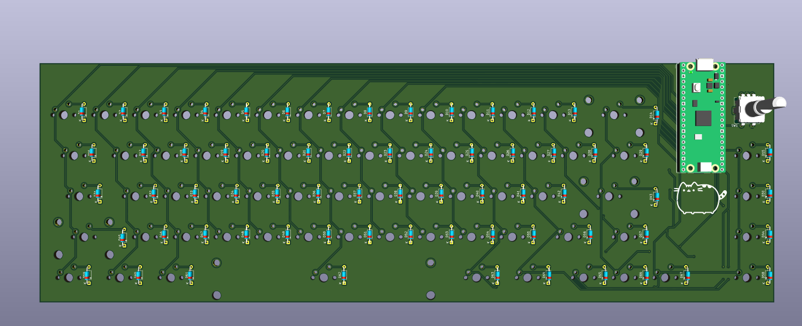

# Journal

## Schematic 
After 3 hours, I finished the schematic, which was quite fun.

Fixed the duplicate column, which I had for some reason.

**Total time: 3 Hours**

## PCB Design 
It then took me 3 hours to have a semi-completed keyboard layout, this was so painful.

Fixed the issue of two extra keys.

After another 3 hours, I finished the PCB.

And then I spent another hour fixing issues, a lot of issues 

And then I spent another hour adding models to my PCB and exporting it into Onshape.

**Total time: 7 Hours**

## Case Design

I spent 2 hours making the case and starting the key plate cutout. 

After another hour, I finished the plate cutout. 

3 hours later, I finished the case.

After that, I spent another 1 hour splitting it into two parts for 3d printing.

**Total time: 7 Hours**

## Firmware
Then I spent 2 hours making the Firmware using RMK, which was the last thing I needed to do for this project.
**Total time: 2 Hours**
