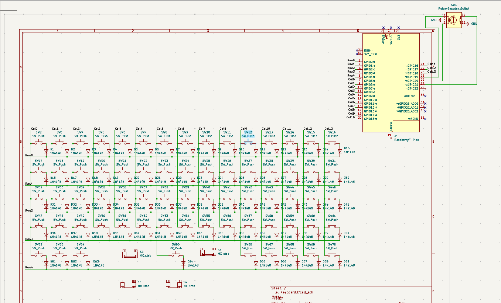
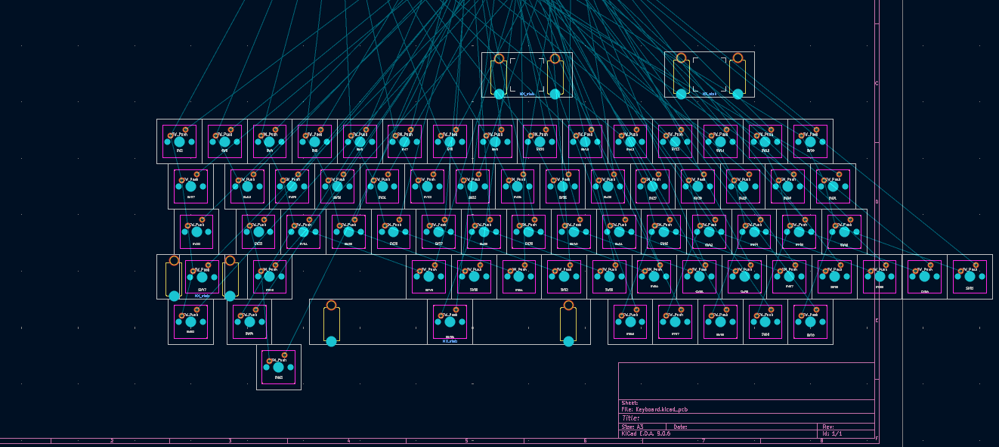
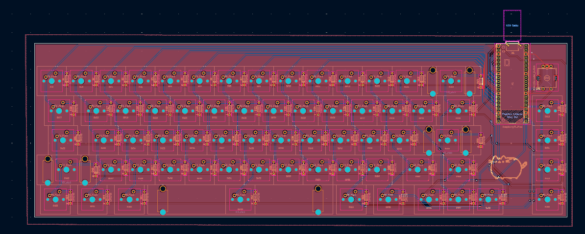
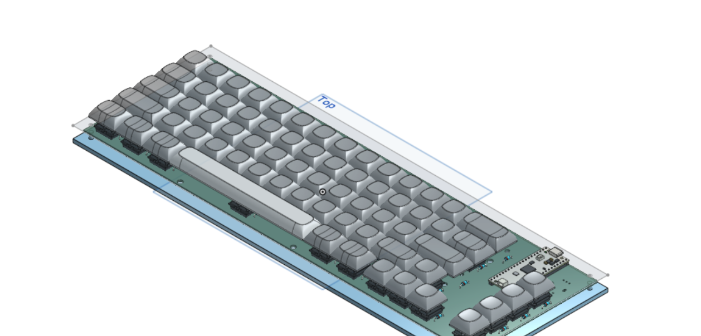
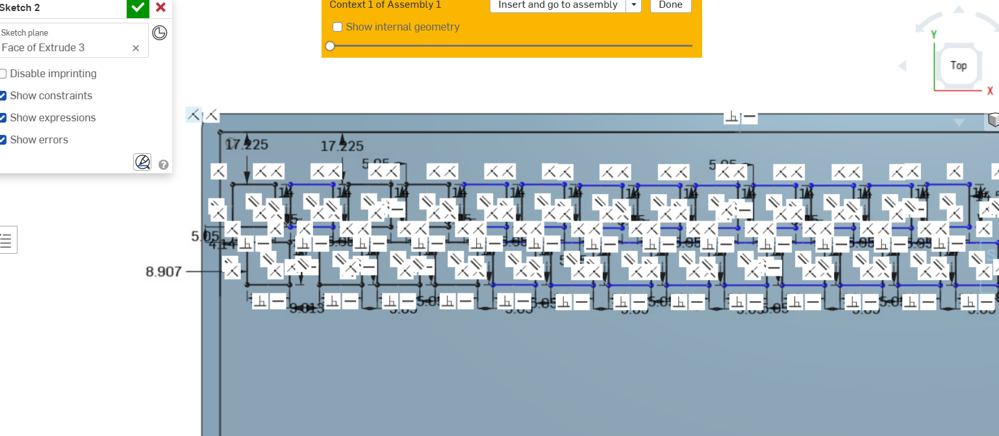
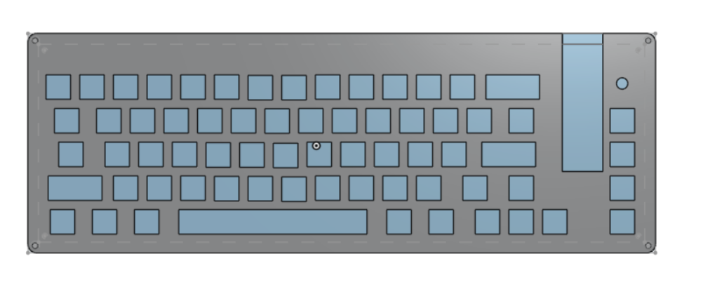

# Journal

## Schematic 
After 3 hours, I finished the schematic, which was quite fun but difficult. 

I Fixed the duplicate column, which I had for some reason.

**Total time: 3 Hours**

## PCB Design 
It then took me 3 hours to have a semi-completed keyboard layout, this took a while as I had to restart multiple times because I messed it up.

I think Fixed the issue of two extra keys, which took longer than I'd like to admit

After another 3 hours, I finished the PCB.

And then I spent another hour fixing issues.

And then I spent another hour adding models to my PCB and exporting it into Onshape which took a while because I couldn't find any models.

**Total time: 7 Hours**

## Case Design

I spent 2 hours making the case and starting the key plate cutout. 

After another hour, I finished the plate cutout. 

3 hours later, I finished the case.

After that, I spent another 1 hour splitting it into two parts for 3d printing.

**Total time: 7 Hours**

## Firmware
Then I spent 2 hours making the Firmware using RMK, which was the last thing I needed to do for this project.

**Total time: 2 Hours**

*Total Project time: 33 hours*
